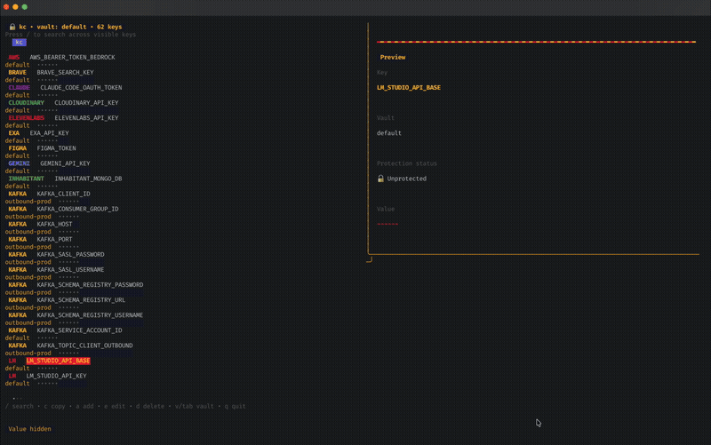

<p align="center">
  
</p>

<h1 align="center">kc</h1>

<p align="center">
  <strong>A human-friendly CLI for macOS Keychain.</strong><br/>
  Because <code>security find-generic-password -s service -a account -w</code> is not human-friendly.
</p>

<p align="center">
  <a href="#install">Install</a> •
  <a href="#quick-start">Quick Start</a> •
  <a href="#commands">Commands</a> •
  <a href="#vaults">Vaults</a> •
  <a href="#shell-integration">Shell Integration</a> •
  <a href="#touch-id">Touch ID</a> •
  <a href="#search">Search</a>
</p>

<p align="center">
  <a href="https://github.com/v-gutierrez/kc/actions/workflows/ci.yml"></a>
  
  
</p>

---

<p align="center">
  
</p>

---

## Why

Every developer on macOS has API keys in `.env` files, `.zshrc`, or `.bashrc` — **plaintext, git-committable, screenshot-visible.**

The native Keychain is the right solution, but the `security` command UX is hostile. **kc** fixes that.

Your secrets never leave the Secure Enclave. Zero external dependencies. Zero network calls. Ever.

## What's New in v0.3.0

- 🔐 **Touch ID protection (default on)** — all secrets require biometric authentication
- 🔍 **`kc search`** — fuzzy search across all vaults
- 📊 **`kc diff`** — compare secrets across vaults
- 📝 **`kc list --json`** — JSON output for scripting
- 🔒 **Audit logging** — track who accessed what, when

## Install

```bash
brew tap v-gutierrez/kc https://github.com/v-gutierrez/kc
brew install kc
```

Or build from source:

```bash
git clone https://github.com/v-gutierrez/kc.git
cd kc
go build -ldflags "-X github.com/v-gutierrez/kc/internal/cli.Version=v0.3.0" -o kc ./cmd/kc
sudo mv kc /usr/local/bin/
```

## Quick Start

```bash
# Interactive TUI (recommended for secret entry)
kc

# One-shot commands are still available,
# but your shell may record CLI arguments in history.
kc set API_KEY "sk-proj-abc123"

# Store without Touch ID protection
kc set API_KEY "sk-proj-abc123" --no-protect

# Read it (copies to clipboard, auto-clears in 30s)
kc get API_KEY

# Search across all vaults
kc search openai

# List all keys (values masked)
kc list

# List as JSON (for scripting)
kc list --json

# Import from .env file
kc import .env

# Load all secrets into your shell (single Touch ID prompt)
eval "$(kc env)"

# Compare vaults
kc diff prod staging

# Search across all vaults
kc search openai
```

## Commands

| Command | Description |
|---------|-------------|
| `kc get <key>` | Read a secret (copied to clipboard + printed masked) |
| `kc set <key> [value]` | Store/update a secret — Touch ID protected by default |
| `kc set <key> --no-protect` | Store without Touch ID protection |
| `kc del <key>` | Delete a secret |
| `kc list` | List all keys (values masked) |
| `kc list --json` | List as JSON for scripting |
| `kc search <query>` | Fuzzy search across all vaults |
| `kc diff <vault1> <vault2>` | Compare keys between two vaults |
| `kc import <file>` | Import from .env file → Keychain |
| `kc export` | Export active vault as .env to stdout |
| `kc export -o <file>` | Export to file |
| `kc env` | Print `export` statements for shell integration |
| `kc init <shell>` | Print the shell init snippet for zsh, bash, or fish |
| `kc setup` | Migrate plaintext shell secrets into Keychain and install shell init |
| `kc migrate --from <service>` | Migrate existing Keychain entries to kc format |
| `kc vault list` | List all vaults |
| `kc vault create <name>` | Create a new vault |
| `kc vault switch <name>` | Set active vault |

## Touch ID

**v0.3.0** introduces biometric protection as the default for all secrets. Every `kc set` stores the secret with Touch ID access control — requiring your fingerprint to read it back.

```bash
# Default: Touch ID required
kc set DB_PASSWORD "super-secret"

# Opt out per key
kc set PUBLIC_KEY "not-sensitive" --no-protect

# kc env prompts Touch ID once, then unlocks all protected keys for the session
eval "$(kc env)"
```

**Why this matters:**
- Physical presence required — no remote exfiltration
- Enterprise-grade audit trail (who touched what, when)
- If Touch ID is unavailable, falls back to system password prompt
- Zero friction in daily workflow — one fingerprint per shell session

## Search

Find secrets across all vaults instantly:

```bash
# Fuzzy search
kc search api

# Search with JSON output
kc search openai --json
```

## Vaults

Vaults are logical groups for your secrets. Under the hood, they map to Keychain "service" fields prefixed with `kc:`.

```bash
kc vault create prod
kc vault create staging
kc vault switch prod
kc set DB_PASS "super-secret"     # saved in vault "prod"
kc get DB_PASS --vault staging    # read from specific vault
```

## Shell Integration

Generate the right shell snippet:

```bash
kc init zsh
kc init bash
kc init fish
```

For zsh or bash, add to your shell rc file:

```bash
eval "$(kc env)"
```

For fish:

```fish
kc env | source
```

That's it. All secrets from your active vault are loaded as environment variables on shell startup.

### One-command onboarding

If you already have plaintext secrets in `~/.zshrc`, `~/.bash_profile`, or fish config, run:

```bash
kc setup
```

`kc setup` detects your shell, shows the secrets it found, imports them into your active vault, comments the old lines with `#kc-migrated#`, and installs the correct init snippet.

### Per-vault loading

```bash
eval "$(kc env --vault prod)"
```

## Security

- **Offline only.** No network calls. Ever.
- **Keychain-native.** AES-256 encryption via macOS Secure Enclave.
- **Touch ID by default.** Physical presence required to read secrets.
- **Clipboard auto-clear.** After `kc get`, clipboard clears in 30s.
- **No plaintext config.** Vault list is inferred from Keychain — no files to leak.
- **Prefer interactive entry for secrets.** The TUI avoids putting secret values on the command line. Shells may record `kc set KEY VALUE` in history.
- **Audit logging.** Every access logged with timestamp and context.

## Data Model

```
macOS Keychain (AES-256 via Secure Enclave)
  └── Service = "kc:{vault_name}"
        └── Account = key_name
              └── Password = secret_value
              └── Access Control = Touch ID (default) | None (--no-protect)
```

## License

[MIT](LICENSE)

---

<p align="center">
  Built with 🏈 by <a href="https://github.com/v-gutierrez">Victor Gutierrez</a>
</p>
